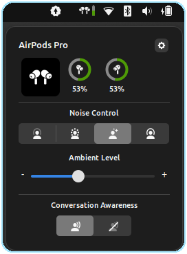
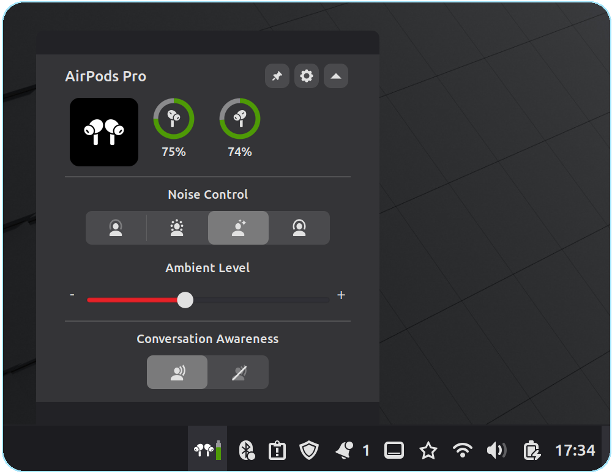
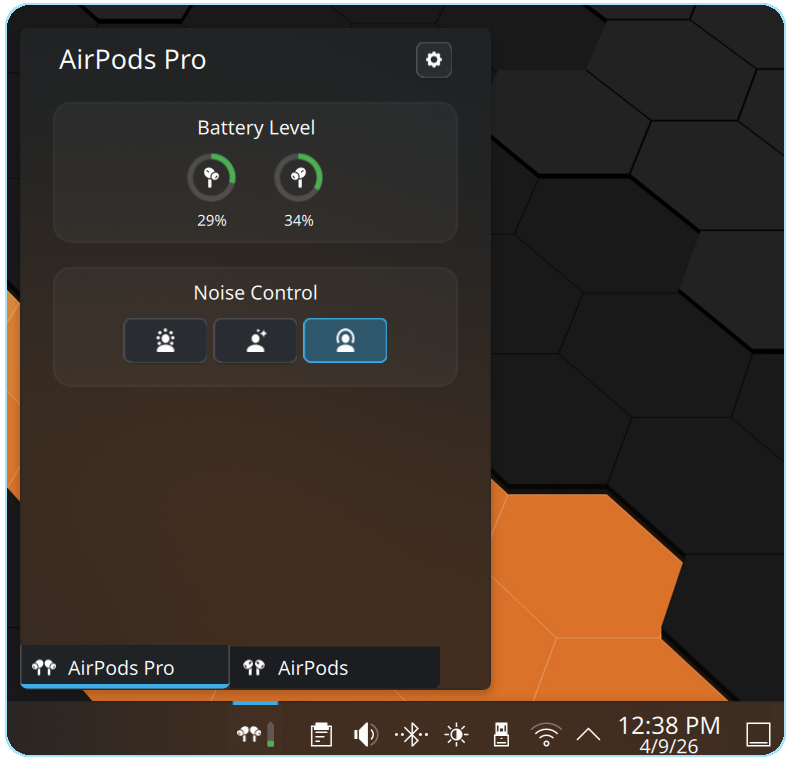
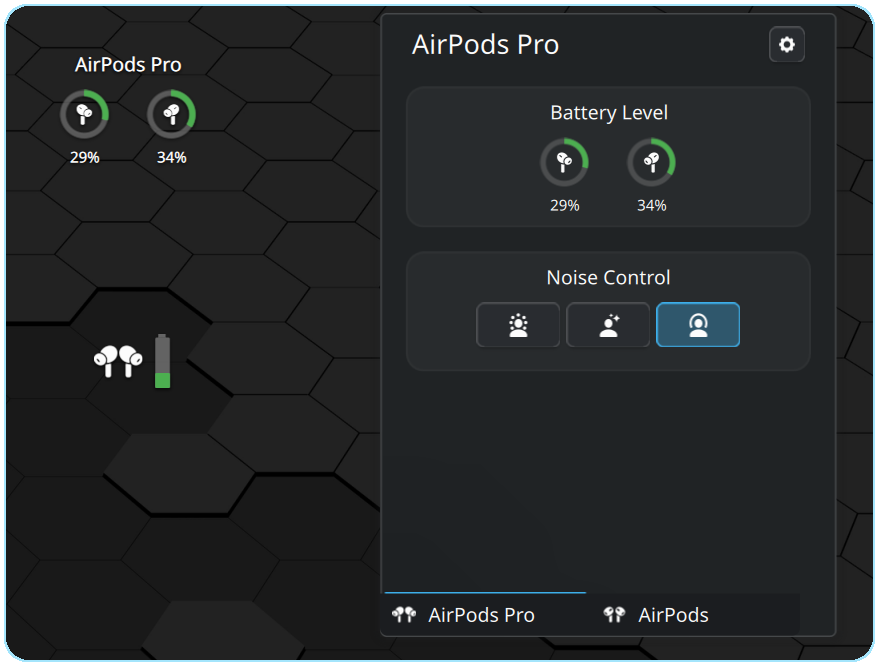

# BudsLink Companion

BudsLink Companion provides desktop environment integrations for the Flatpak application [**BudsLink**](https://github.com/maniacx/BudsLink).

See the respective branches for the implementation.

## [GNOME Shell Extension](https://github.com/maniacx/BudsLink-Companion/tree/Gnome-Extension)

## [Cinnamon Applet](https://github.com/maniacx/BudsLink-Companion/tree/Cinnamon-Applet)

## [Plasma Widget](https://github.com/maniacx/BudsLink-Companion/tree/Plasma-Widget)

### Panel Widget

### Desktop Widget

